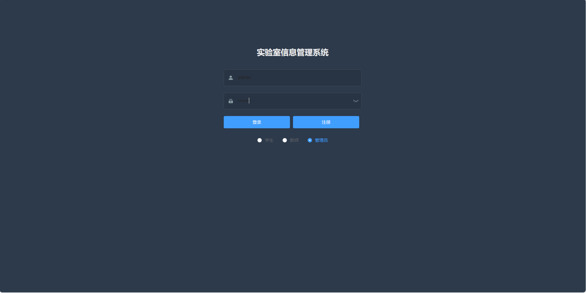

# 基于springboot+vue前后端分离的实验室预约管理系统

### 9.9￥ 获取完整源码+sql，附赠8000字论文参考，需要的加Q：3808981644 备用Q：3577148218
### 有问题，或者需要协助调试运行项目的也可联系
### 获取更多项目，关注公众号：编程项目集

## 一、介绍

运行环境:idea或eclipse vscode 数据库:mysql

开发语言：java

前端技术：vue、element-ui

后端技术：springboot、mybatisplus

主要功能：

登录角色:学生、教师、管理员

学生:
1.登录，注册
2.实验室查询
3.公告
4.订阅课程
5.查看公告
6.订阅课程
7、实验室耗材管理（材料列表、报修）
8、个人信息

教师登录:
1、设备列表
2、实验室查询、预约审核
3、统计分析
4、公告列表
5、材料列表、报修
6、个人信息

管理员登录:
1、用户管理
2、设备管理
3、实验室查询、预约审核
4、统计分析
5、公告管理
6、课程管理
7、实验室耗材管理（材料列表、材料删除、添加材料、报修列表）

## 二、部分页面截图展示

## 三、8000字论文参考

### 9.9￥ 获取完整源码+sql，附赠8000字论文参考，需要的加Q：3808981644 备用Q：3577148218
### 有问题，或者需要协助调试运行项目的也可联系

